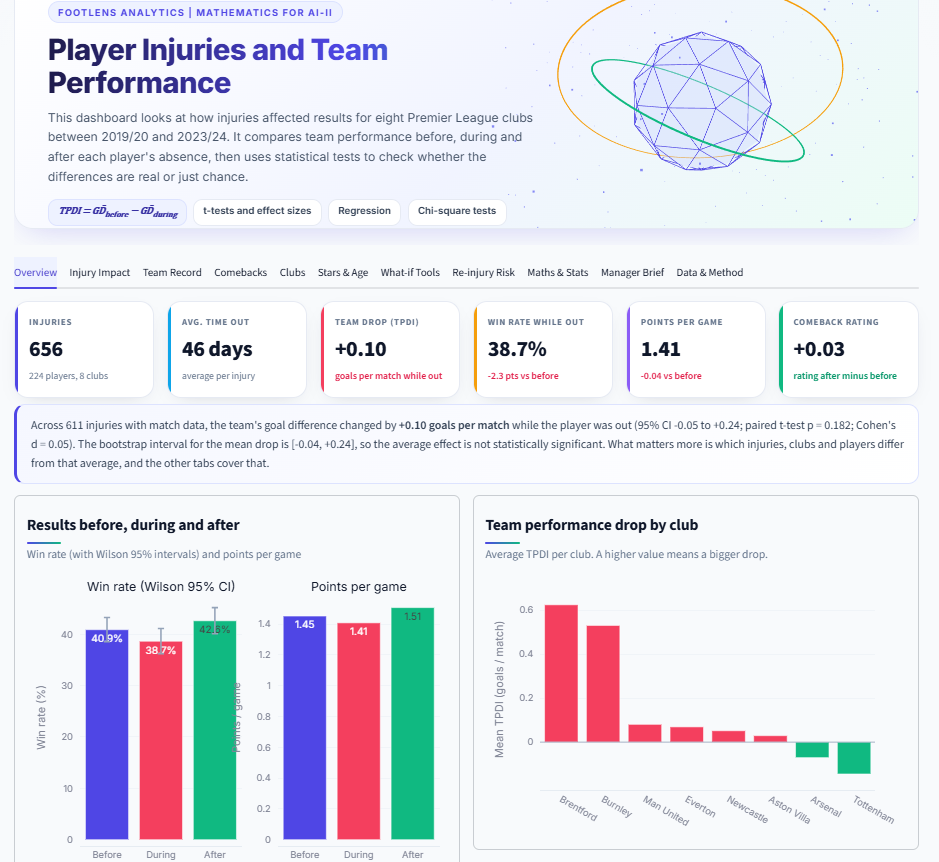

# FootLens Analytics: Player Injuries and Team Performance

> **Course:** Mathematics for AI-II · **CRS:** Artificial Intelligence · **Assessment:** Summative (Scenario 1)
> **Student:** Sri Prasath.P · **Registration No.:** 1000408 · **School:** Jain Vidyalaya IB World School

**Live dashboard:** [https://1000408sri-prasathpsaaiy2mathematics-hp8y48eqg7wko5ofpgre2q.streamlit.app/](https://1000408sri-prasathpsaaiy2mathematics-hp8y48eqg7wko5ofpgre2q.streamlit.app/)



**Screenshots:** [Click here to see all the screenshots](screenshots/)

---

## 1. Project overview

This project looks at how player injuries affect a club's results, and what technical directors can learn from that for training
load, rotation and squad planning. The dataset has 656 injuries from 8 Premier League clubs over 5 seasons (2019/20 to 2023/24).
For each injury it records three matches before, three during the absence and three after the return.

All the analysis is done in Python, and each result is backed by a formula, a confidence interval or a hypothesis test.

### Research questions

| # | Question | Where answered |
|---|---|---|
| Q1 | Which injuries led to the biggest team performance drop? | Injury Impact |
| Q2 | What was the team's win/loss record during player absence? | Team Record |
| Q3 | How did individual players perform after recovery? | Comebacks |
| Q4 | Are there specific months or clubs with frequent injury clusters? | Clubs |
| Q5 | Which clubs suffer most due to injuries? | Clubs |
| Q6 | Does age explain how much a team suffers? | Stars & Age |
| Q7 | Do longer injuries hurt the team more? | Maths & Stats |
| Q8 | Does losing a star player hurt the team more? | Stars & Age |

## 2. Key features

- A light theme with KPI cards and a tabbed layout.
- Sidebar filters for club, season, position group and age range. They update every chart, table and statistic.
- **The 5 required visuals (all interactive Plotly):**
  1. Bar chart: top 10 injuries by team performance drop (with 95% CI error bars)
  2. Line chart: player timeline before → out → after (rating line + team goal-difference bars)
  3. Heatmap: injuries by club × month (count or χ² standardised residuals)
  4. Scatter plot: age vs performance drop index (OLS line + 95% confidence band)
  5. Leaderboard table: comeback players ranked by rating improvement
- **Six extra tools beyond the brief:**
  1. **Star vs squad test** (Stars & Age): Welch t-test, Mann-Whitney U and Cohen's d on injuries to higher-rated players versus the rest.
  2. **Absence simulator** (What-if Tools): Monte Carlo simulation with a Dirichlet-multinomial model that estimates points lost over a run of missed matches, with ranges.
  3. **Expected time-out calculator** (What-if Tools): median and 80% range for similar injuries, with a log-normal fit and bootstrap interval.
  4. **Re-injury risk** (Re-injury Risk): Kaplan-Meier survival curves, Greenwood confidence bands and a log-rank test for how long players stay injury-free after returning.
  5. **Club comparison** (Clubs): two clubs side by side, plus an animated chart of injury burden building up season by season.
  6. **Manager's brief** (Manager Brief): a downloadable HTML report with data-driven recommendations, charts and tables that can be printed to PDF.
- **3D hero banner** built with Three.js (loaded from cdnjs). If it cannot load, a plain CSS banner is shown instead. Motion is switched off for users who prefer reduced motion.
- **Extra visuals:** severity box plot, win-rate/PPG by phase, PPG by club, club Injury Burden Index, rating-change histogram, bootstrap histogram, Spearman correlation heatmap.
- **Maths & Stats tab:** paired t-test, Wilcoxon signed-rank, Cohen's d, bootstrap CI, Pearson/Spearman correlation, simple and multiple OLS regression (normal equations), Kruskal-Wallis, χ² tests, Cramér's V, Wilson intervals.
- Research answers that are recalculated from the filtered data.
- The dashboard only runs if `player_injuries_impact.csv` is in the repo and has the expected columns. If not, it shows an error page and stops.
- The filtered, cleaned data can be downloaded as CSV.

## 3. The mathematics

| Metric | Formula |
|---|---|
| Team Performance Drop Index | `TPDI = mean(GD before) − mean(GD during)` (goals per match; positive = worse) |
| Standardised TPDI | `z = (TPDI − μ) / σ` |
| Points per game | `PPG = (3W + D) / (W + D + L)` |
| Paired t-test | `t = d̄ / (s_d / √n)`, effect size `d_z = d̄ / s_d` |
| 95% CI of a mean | `x̄ ± t(0.975, n−1) · s / √n` |
| Wilson interval | `[p̃ ± z·√(p̂(1−p̂)/n + z²/4n²)]` |
| Regression | `β = (XᵀX)⁻¹ Xᵀ y`, `R² = 1 − SS_res / SS_tot` |
| Injury Burden Index | `IBI = (1/S) · Σ days_out · FIFA/100` (S = number of seasons) |
| Residual (clustering) | `(O − E) / √E`, `E = row total × col total / N` |

Note: with only three matches per phase the data is noisy, and injured players were often in good form beforehand (regression to the
mean). Because of this the dashboard reports confidence intervals and effect sizes as well as raw averages.

## 4. Data preprocessing (Step 2)

Implemented in `data_processing.py` (modular, commented functions):

- Loads with pandas; converts the `"N.A."` placeholders (about 4,800 cells) to real `NaN`.
- Renames the 42 raw columns into readable names such as `before_2_rating`, `during_1_gd`, `club`, `injury_date`.
- Parses **mixed date formats** (`Nov 9, 2019`, `Oct 15,2022`, `January 4, 2023`, `Present`), fixes return-date year typos, invalidates impossible dates.
- Standardises injury labels (139 → 102 unique) and groups them into 17 injury families; groups positions into Defender / Midfielder / Forward / Goalkeeper.
- **Feature engineering:** average rating before/after and change, goal difference and points-per-game per phase, `tpdi`, `tpdi_z`, `days_out`, severity class, age band, injury month.
- Missing values are not imputed. `N.A.` means the match was not played, so averages use the matches available.
- `player_summary()` groups by player to summarise before, during and after.

## 5. Repository structure

```
IADAI102-<StudentID>-<YourName>/
├── app.py                          # Streamlit dashboard (UI + wiring)
├── data_processing.py              # loading, cleaning, feature engineering
├── analytics.py                    # groupby/agg, pivot tables, statistics, maths
├── charts.py                       # all Plotly figures
├── report.py                       # builds the downloadable manager's brief
├── styles.py                       # CSS theme, 3D hero banner, HTML components
├── player_injuries_impact.csv      # dataset (REQUIRED, the app stops without it)
├── requirements.txt                # Python dependencies
├── README.md
├── .gitignore
├── .streamlit/
│   └── config.toml                 # light theme
└── screenshots/                    # dashboard screenshots used in this README
```

## 6. Integration details

`app.py` → reads `player_injuries_impact.csv` (via `pathlib`, relative to the repository) → `data_processing.load_dataset()`
(validation + cleaning, cached with `st.cache_data`) → sidebar filters → `analytics` functions → `charts` figures → rendered in tabs.
If the CSV is missing or malformed, `DatasetError` is raised and the app shows an error card and calls `st.stop()`.

## 7. Run locally

```bash
git clone https://github.com/<your-username>/<your-repo>.git
cd <your-repo>
python -m venv .venv && source .venv/bin/activate     # Windows: .venv\Scripts\activate
pip install -r requirements.txt
streamlit run app.py
```

## 8. Deployment instructions (Streamlit Community Cloud)

1. Create a GitHub repository (e.g. `IADAI102-<StudentID>-<YourName>`) and upload **all the files above** (all `.py` files and the CSV go in the repo root, next to `app.py`), plus the `.streamlit/config.toml` and `screenshots/` folders.
2. Go to <https://share.streamlit.io> and sign in with GitHub.
3. Click **Create app → Deploy a public app from GitHub**.
4. Select your repository, branch `main`, and main file path `app.py`.
5. (Optional) Under **Advanced settings** choose Python 3.11 or 3.12.
6. Click **Deploy**. The deployed app is here: https://1000408sri-prasathpsaaiy2mathematics-hp8y48eqg7wko5ofpgre2q.streamlit.app/
7. In the repo go to **Settings → Collaborators** and add `ai.assignments@wacpinternational.org`.

## 9. Limitations & assumptions

- The order of "Before 1-3" follows the dataset's column order (the CSV does not state whether Match 1 is the closest match to the injury).
- Each phase has only three matches, so per-injury indices are noisy; conclusions rely on aggregation across many episodes.
- Missing match/rating data is left missing rather than guessed.

## 10. References

- Hägglund, M. et al. (2013). Injuries affect team performance negatively in professional football. *British Journal of Sports Medicine*, 47, 738-742.
- Ekstrand, J. et al. (2011). Injury rates in professional football: the UEFA Elite Club Injury Study. *British Journal of Sports Medicine*.
- Cohen, J. (1988). *Statistical Power Analysis for the Behavioral Sciences.*
- Streamlit docs: <https://docs.streamlit.io> · Plotly Express: <https://plotly.com/python/plotly-express/>
